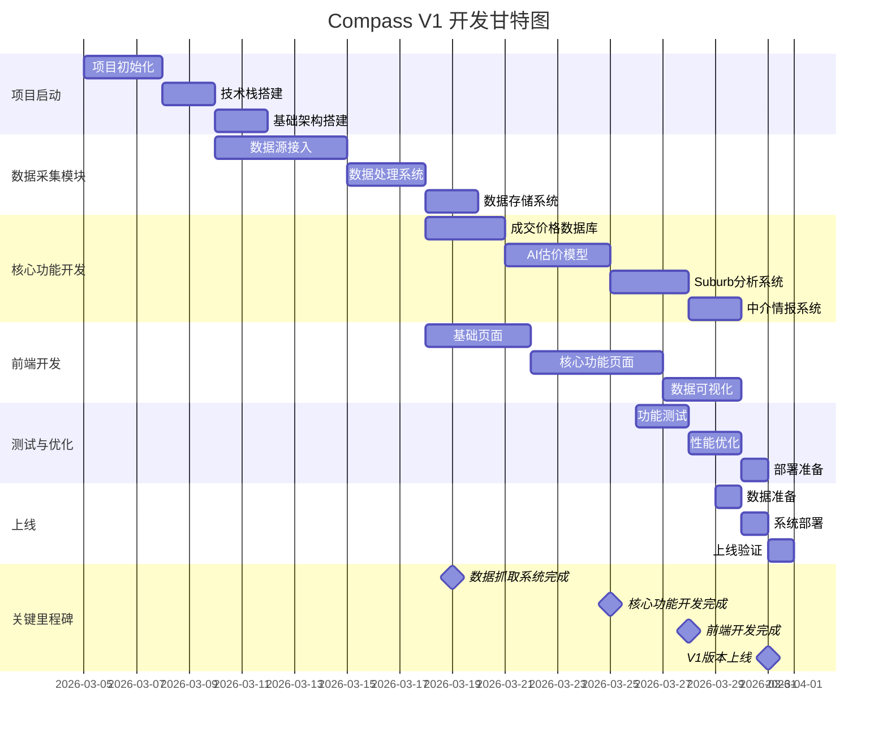

# Compass 30天开发甘特图

## 甘特图说明

### 第1-5天：项目启动阶段

**第1-3天：项目初始化**
- 搭建开发环境
- 创建项目目录结构
- 配置版本控制系统
- 初始化后端和前端项目

**第4-5天：技术栈搭建**
- 配置FastAPI后端框架
- 配置Next.js前端框架
- 配置PostgreSQL数据库
- 配置Supabase连接

**第6-7天：基础架构搭建**
- 设计API基础结构
- 配置环境变量
- 搭建日志系统
- 配置监控系统

### 第8-17天：数据采集模块开发

**第8-12天：数据源接入**
- 实现Realestate.com.au抓取
- 实现Domain.com.au抓取
- 实现Queensland Titles Office数据获取
- 实现Auction结果数据获取

**第13-15天：数据处理系统**
- 实现数据清洗模块
- 实现数据验证机制
- 实现异常数据处理
- 实现数据标准化流程

**第16-17天：数据存储系统**
- 实现PostgreSQL数据库表结构
- 实现数据入库逻辑
- 实现数据备份机制
- 实现历史数据归档

### 第18-25天：核心功能开发

**第18-20天：成交价格数据库**
- 实现数据查询接口
- 实现数据统计分析
- 实现历史数据对比
- 实现数据导出功能

**第21-24天：AI估价模型**
- 实现基础回归模型（RandomForest）
- 实现特征工程
- 实现模型训练流程
- 实现估价接口

**第25-27天：Suburb分析系统**
- 实现Suburb数据统计
- 实现趋势分析算法
- 实现市场温度指数计算
- 实现分析报告生成

**第28天：中介情报系统**
- 实现中介数据管理
- 实现成交排行榜
- 实现专长区域分析
- 实现独家房源识别

### 第18-28天：前端开发

**第18-21天：基础页面**
- 实现首页布局
- 实现工具页布局
- 实现分析页布局
- 实现导航系统

**第22-26天：核心功能页面**
- 实现今日成交展示
- 实现热门Suburb展示
- 实现免费估价工具
- 实现Suburb查询功能
- 实现开发地块查询功能

**第27-29天：数据可视化**
- 实现价格趋势图表
- 实现市场分析图表
- 实现数据对比图表
- 实现地图可视化

### 第26-30天：测试与优化

**第26-27天：功能测试**
- 测试数据抓取功能
- 测试数据处理功能
- 测试核心API功能
- 测试前端交互功能

**第28-29天：性能优化**
- 优化数据抓取速度
- 优化数据库查询性能
- 优化API响应时间
- 优化前端加载速度

**第30天：部署准备**
- 配置生产环境
- 实现CI/CD流程
- 配置监控和告警
- 准备部署文档

### 第30天：上线

**第30天上午：数据准备**
- 完成3个suburb的数据抓取
- 建立基础成交数据库
- 训练初始估价模型
- 生成初始市场分析报告

**第30天下午：系统部署**
- 部署后端服务
- 部署前端应用
- 配置域名和SSL
- 启动数据抓取任务

**第30天晚上：上线验证**
- 验证核心功能正常运行
- 验证数据准确性
- 验证系统稳定性
- 收集用户反馈

## 关键里程碑

1. **第19天：数据抓取系统完成**
   - 所有数据源接入完成
   - 数据处理和存储系统就绪
   - 开始数据积累

2. **第25天：核心功能开发完成**
   - 成交价格数据库功能完成
   - AI估价模型功能完成
   - Suburb分析系统功能完成
   - 中介情报系统功能完成

3. **第28天：前端开发完成**
   - 所有页面开发完成
   - 核心功能页面实现
   - 数据可视化功能完成

4. **第31天：V1版本上线**
   - 系统正式上线
   - 开始服务用户
   - 进入运营阶段

## 资源分配建议

### 开发团队配置
- 后端开发：2人
- 前端开发：2人
- 数据工程师：1人
- 测试人员：1人

### 关键资源需求
- 服务器：2台（开发和生产）
- 数据库：PostgreSQL实例
- 存储：对象存储服务
- 监控：APM工具

## 风险控制

### 潜在风险
1. **数据抓取被封**
   - 应对措施：使用代理IP、降低抓取频率、轮换用户代理

2. **数据质量问题**
   - 应对措施：加强数据验证、建立异常检测机制

3. **模型训练时间过长**
   - 应对措施：使用预训练模型、优化特征工程

4. **前端开发进度滞后**
   - 应对措施：优先实现核心功能、使用组件库加速开发

5. **部署问题**
   - 应对措施：提前进行部署测试、使用容器化部署

### 缓解策略
- 建立每日站会，及时发现和解决问题
- 制定详细的项目计划，明确每个任务的负责人和时间节点
- 预留20%的缓冲时间，应对突发情况
- 建立代码审查机制，确保代码质量
- 定期进行系统测试，确保功能正常
