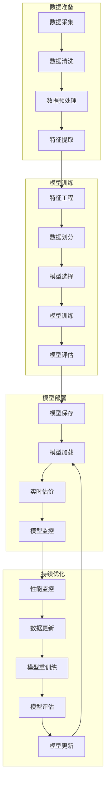

# Compass AI 估价训练流程

## 训练流程概述



## 详细训练流程

### 1. 数据准备阶段

#### 1.1 数据采集
- 从多个数据源获取房产数据：
  - Realestate.com.au
  - Domain.com.au
  - Queensland Titles Office
  - Auction结果数据
- 数据字段包括：
  - 地址、郊区、邮编
  - 土地面积、建筑面积
  - 卧室数量、浴室数量、停车位数量
  - 成交价格、成交日期
  - 房产类型、挂牌天数
  - 中介信息、数据来源

#### 1.2 数据清洗
- 处理缺失值：
  - 数值型数据：使用均值、中位数或众数填充
  - 分类数据：使用最常见类别填充
- 处理异常值：
  - 使用IQR方法检测异常值
  - 对异常值进行标记或修正
- 去重处理：
  - 基于地址和成交日期去重
  - 保留最新或最完整的记录

#### 1.3 数据预处理
- 标准化地址格式：
  - 统一地址格式
  - 提取街道名、门牌号等信息
- 转换数据类型：
  - 将字符串转换为数值型
  - 将日期转换为时间戳
- 处理时间特征：
  - 提取年份、月份、季度
  - 计算时间差

#### 1.4 特征提取
- 地理特征：
  - 距离CBD距离
  - 距离最近学校距离
  - 距离最近购物中心距离
- 社区特征：
  - Suburb median价格
  - Suburb人口密度
  - Suburb犯罪率
- 房产特征：
  - 土地面积/建筑面积比率
  - 每平米价格
  - 房产年龄

### 2. 特征工程阶段

#### 2.1 特征选择
- 使用相关性分析选择重要特征
- 使用LASSO回归进行特征选择
- 基于领域知识选择特征

#### 2.2 特征转换
- 数值特征：
  - 标准化（StandardScaler）
  - 归一化（MinMaxScaler）
  - 对数转换
- 分类特征：
  - 独热编码（One-Hot Encoding）
  - 标签编码（Label Encoding）
- 时间特征：
  - 周期性特征（sin/cos转换）
  - 时间趋势特征

#### 2.3 特征组合
- 创建交互特征：
  - 土地面积 × 距离CBD
  - 卧室数量 × 浴室数量
- 创建聚合特征：
  - 过去6个月Suburb平均成交价格
  - 过去6个月Suburb成交数量

### 3. 模型训练阶段

#### 3.1 模型选择
- 基础模型：
  - 随机森林回归（RandomForestRegressor）
  - XGBoost回归（XGBRegressor）
  - 梯度提升回归（GradientBoostingRegressor）
- 集成方法：
  - 投票回归（VotingRegressor）
  - 堆叠回归（StackingRegressor）

#### 3.2 超参数调优
- 使用网格搜索（GridSearchCV）
- 使用随机搜索（RandomizedSearchCV）
- 使用贝叶斯优化

#### 3.3 模型训练
- 训练集：70%数据
- 验证集：15%数据
- 测试集：15%数据
- 交叉验证：5折交叉验证

#### 3.4 模型评估
- 评估指标：
  - 均方误差（MSE）
  - 均方根误差（RMSE）
  - 平均绝对误差（MAE）
  - R²得分
- 误差分析：
  - 分析预测误差分布
  - 识别误差较大的样本
  - 分析误差与特征的关系

### 4. 模型部署阶段

#### 4.1 模型保存
- 保存模型权重和配置
- 保存特征工程参数
- 保存模型元数据（训练时间、评估指标等）

#### 4.2 模型加载
- 加载预训练模型
- 加载特征工程参数
- 初始化模型服务

#### 4.3 实时估价
- 接收估价请求
- 提取特征
- 进行特征工程
- 模型预测
- 返回估价结果

#### 4.4 模型监控
- 监控模型性能
- 监控预测分布
- 监控数据漂移

### 5. 持续优化阶段

#### 5.1 性能监控
- 定期评估模型性能
- 监控预测误差
- 监控数据质量

#### 5.2 数据更新
- 定期获取新数据
- 更新训练数据集
- 处理数据漂移

#### 5.3 模型重训练
- 每月自动重训练
- 当性能下降时触发重训练
- 使用最新数据进行训练

#### 5.4 模型评估
- 评估新模型性能
- 与旧模型进行对比
- 验证模型改进

#### 5.5 模型更新
- 部署新模型
- 逐步切换流量
- 监控新模型性能

## 技术实现

### 1. 数据处理
- 使用Pandas进行数据处理
- 使用NumPy进行数值计算
- 使用Scikit-learn进行特征工程

### 2. 模型训练
- 使用Scikit-learn实现基础模型
- 使用XGBoost实现梯度提升模型
- 使用Optuna进行超参数优化

### 3. 模型部署
- 使用FastAPI部署模型API
- 使用Redis进行缓存
- 使用Docker进行容器化部署

### 4. 监控系统
- 使用Prometheus监控模型性能
- 使用Grafana可视化监控指标
- 使用Alertmanager设置告警

## 估价输出格式

```json
{
  "property_id": "12345",
  "address": "123 Main St, Brisbane",
  "suburb": "Brisbane City",
  "valuation_date": "2026-03-04",
  "estimates": {
    "low": 850000,
    "mid": 925000,
    "high": 1000000
  },
  "confidence": 0.85,
  "market_temperature": 7,
  "comparable_properties": [
    {
      "address": "125 Main St, Brisbane",
      "sold_price": 900000,
      "sold_date": "2026-02-15",
      "similarity": 0.95
    }
  ],
  "trend_analysis": {
    "suburb_median_trend": 0.05,
    "six_month_trend": 0.08,
    "market_commentary": "该区域房价呈上升趋势，预计未来6个月将继续上涨。"
  }
}
```

## 模型性能目标

### V1版本
- RMSE < $50,000
- MAE < $35,000
- R² > 0.85
- 响应时间 < 1秒

### 长期目标
- RMSE < $30,000
- MAE < $20,000
- R² > 0.90
- 响应时间 < 500ms

## 训练计划

### 初始训练
- 使用过去2年的成交数据
- 训练时间：约4-6小时
- 特征数量：约20-30个

### 定期重训练
- 频率：每月一次
- 训练时间：约2-4小时
- 增量更新：只使用新数据

### 触发式重训练
- 当性能下降超过5%
- 当新数据量超过10%
- 当市场出现重大变化

## 风险控制

### 1. 数据质量风险
- 措施：建立数据验证机制，定期检查数据质量
- 监控：设置数据质量指标，当指标异常时告警

### 2. 模型过拟合风险
- 措施：使用交叉验证，添加正则化项
- 监控：监控训练集和验证集的性能差异

### 3. 数据漂移风险
- 措施：定期评估数据分布变化
- 监控：设置数据漂移检测，当漂移超过阈值时重训练

### 4. 计算资源风险
- 措施：使用增量训练，优化模型结构
- 监控：监控训练时间和资源使用情况

## 未来优化方向

1. **深度学习模型**：探索使用神经网络提高预测精度
2. **迁移学习**：利用其他城市的模型加速训练
3. **实时特征**：整合实时市场数据提高预测准确性
4. **个性化估价**：根据用户需求提供定制化估价
5. **多模态数据**：整合图片、视频等多模态数据
