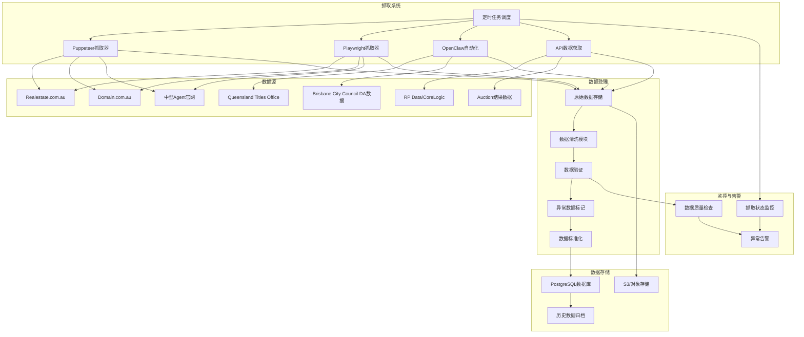

# Compass 数据抓取流程图

## 数据抓取流程说明

### 1. 定时任务调度
- 使用Cron Job设置每日抓取任务
- 按优先级顺序抓取不同数据源
- 支持手动触发和自动重试机制

### 2. 数据源抓取

#### 主要数据源：
- **Realestate.com.au**：使用Puppeteer/Playwright抓取房源列表和详情
- **Domain.com.au**：使用Puppeteer/Playwright抓取房源列表和详情
- **Queensland Titles Office**：使用OpenClaw自动化抓取产权数据
- **RP Data/CoreLogic**：通过API获取专业房地产数据
- **中型Agent官网**：使用Puppeteer/Playwright抓取独家房源
- **Auction结果数据**：通过API或网页抓取拍卖结果
- **Brisbane City Council DA数据**：使用OpenClaw自动化抓取开发申请数据

#### 抓取策略：
- 增量抓取：只抓取新数据和更新数据
- 全量抓取：定期进行全量抓取以确保数据完整性
- 反爬虫措施：使用代理IP、随机延迟、用户代理轮换

### 3. 数据处理

#### 数据清洗：
- 去除重复数据
- 处理缺失值
- 标准化地址格式
- 转换数据类型

#### 数据验证：
- 验证价格范围合理性
- 验证日期格式
- 验证房产属性数据

#### 异常数据处理：
- 标记异常价格（过高或过低）
- 标记异常挂牌天数
- 标记数据来源不可靠的记录

### 4. 数据存储

#### 存储策略：
- **PostgreSQL**：存储结构化数据，支持复杂查询
- **S3/对象存储**：存储原始数据和抓取的图片
- **历史数据归档**：对超过2年的数据进行归档处理

#### 数据同步：
- 实时同步：重要数据实时入库
- 批量同步：常规数据批量入库

### 5. 监控与告警

#### 抓取状态监控：
- 监控抓取任务执行状态
- 监控抓取速度和成功率
- 监控API调用频率限制

#### 数据质量检查：
- 检查数据完整性
- 检查数据一致性
- 检查数据时效性

#### 异常告警：
- 抓取失败告警
- 数据质量异常告警
- 系统异常告警

## 技术实现要点

1. **分布式抓取**：使用多个抓取节点，提高抓取效率
2. **缓存机制**：缓存已抓取的数据，减少重复请求
3. **数据去重**：使用哈希算法对数据进行去重
4. **断点续传**：支持抓取任务的断点续传
5. **日志记录**：详细记录抓取过程和错误信息

## 性能优化

1. **并行抓取**：同时抓取多个数据源
2. **增量更新**：只处理新增和更新的数据
3. **数据压缩**：压缩存储原始数据
4. **索引优化**：为数据库表创建合适的索引
5. **批量操作**：使用批量插入和更新提高数据库操作效率
