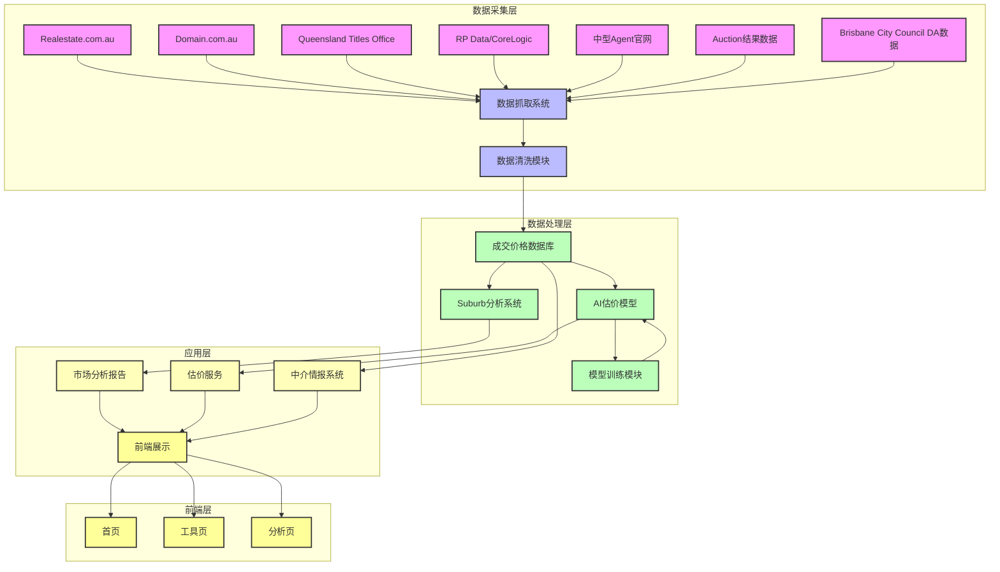

# Compass 系统架构图

## 架构说明

### 1. 数据采集层
- **数据源**：从多个渠道获取房地产数据，包括主流房产网站、政府数据库和中介官网
- **数据抓取系统**：使用Puppeteer、Playwright和OpenClaw进行自动化抓取
- **数据清洗模块**：处理原始数据，去除异常值，标准化格式

### 2. 数据处理层
- **成交价格数据库**：存储所有成交记录，支持历史版本对比
- **Suburb分析系统**：分析各区域的价格趋势、租售比等指标
- **AI估价模型**：基于机器学习算法进行房产估值
- **模型训练模块**：定期更新模型，提高估价准确性

### 3. 应用层
- **市场分析报告**：生成中文市场解读文章
- **估价服务**：提供房产估价功能
- **中介情报系统**：分析中介业绩和专长区域

### 4. 前端层
- **首页**：展示今日成交、热门Suburb、最新分析文章
- **工具页**：提供免费估价、Suburb查询、开发地块查询功能
- **分析页**：展示详细的市场分析数据

## 技术栈

- **后端**：Python、FastAPI、PostgreSQL、Supabase
- **前端**：Next.js、Tailwind、Vercel
- **自动化**：OpenClaw、Cron
- **机器学习**：RandomForest、XGBoost
